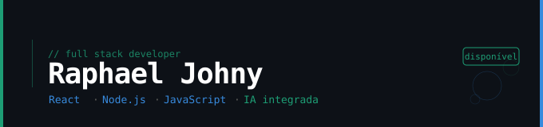

<div align="left">



<br>

Desenvolvedor web full stack com foco em React e Node.js.
Construo aplicações reais e integro IA onde faz sentido.
Disponível para projetos freelance.

---

### Stack


---

### Projetos

📱 **[EscalaPlantões](https://play.google.com/store/apps/details?id=br.com.escalaplantoes)**  
App Android para trabalhadores de saúde e segurança em escala rotativa. Cálculo automático de turnos, calendário visual, folha de ponto em PDF, widget e assistente IA com Gemini integrado.  
`Android` `Gemini AI` `Play Store`

🤖 **[Bot GTA RP](https://github.com/rjohny-dev/botdc)**  
Bot de gerenciamento para servidor de roleplay com rastreamento de ações por cargo e menus interativos.  
`Node.js` `Discord.js`

📱 **[MenuQR](https://github.com/rjohny-dev/menuqr)**
Plataforma SaaS de cardápio digital para restaurantes. Clientes acessam o menu via QR Code e enviam pedidos diretamente para o WhatsApp do estabelecimento. Desenvolvido com autenticação segura, upload de arquivos e arquitetura multi-tenant.
`React` `Node.js` `PostgreSQL` `WhatsApp QR Code` `Vercel`


🚧 **Em breve** — Novo projeto web com IA integrada.  
`React` `Node.js` `IA`

---

### Certificações recentes

```
✓  Análise e Desenvolvimento de Sistemas     — Estácio 2024 (Ensino Superior/Graduação)
✓  Administração de Banco de Dados           — Anhanguera 2026 (Pós Graduação)
✓  Produtividade com IA no Desenvolvimento   —  B7Web  2026
✓  Prompt Engineering para Desenvolvedores   —  B7Web  2026
✓  Fundamentos da IA para Programadores      —  B7Web  2026
✓  Front End React                           —  Blue EdTech
```

---

### Contato

[](https://www.linkedin.com/in/raphael-johny-93a331213/)
[](https://wa.me/5524993078963)

</div>
